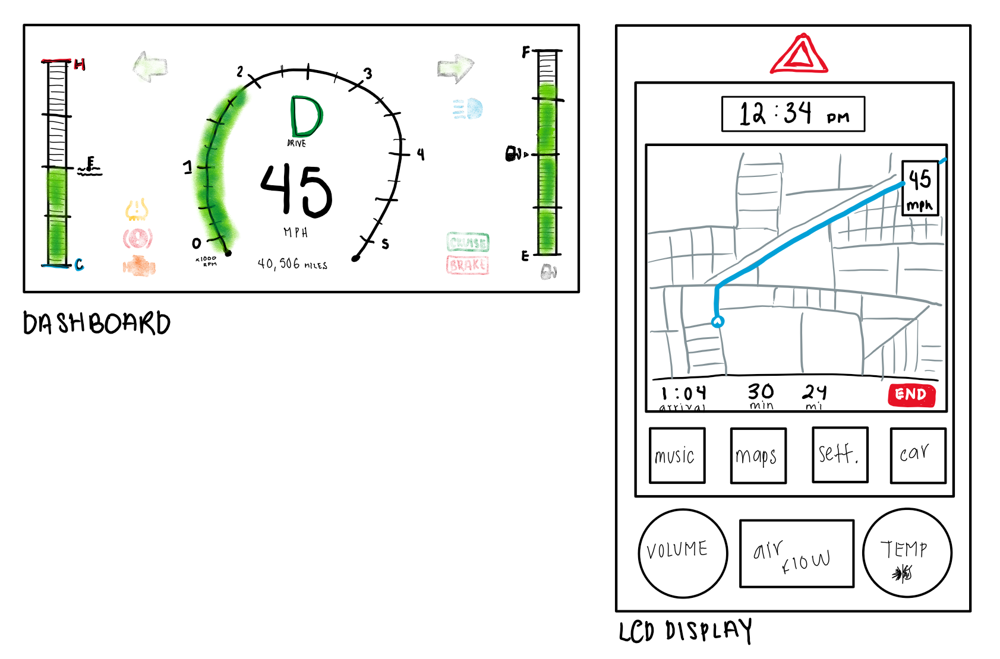
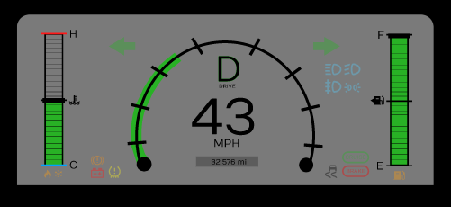
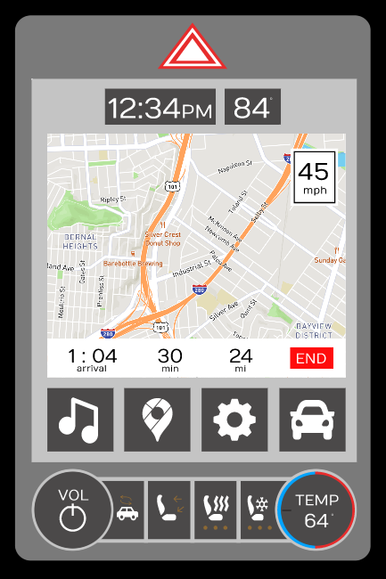

#CS 4331 - Human Computer Interaction

Team: Emily Quintanilla & Eric Santana

[Project Page](https://emilyqelizabeth.github.io/p2EmilyQuintanillaEricSantana/)

## About the Project
  - We analyzed existing car dashboards and LCD Displays, discussed what was good and bad in the designs, and utilized that information to design a new dashboard and LCD display. We then implemented our design using Figma.

## Dashboard and LCD Display Design
  

## Software Used
  - Figma to create and animate High Fidelity Prototype

## Final Interface of Dashboard
  

## Final Interface of LCD Display
  

## Gif of Final Interface
  