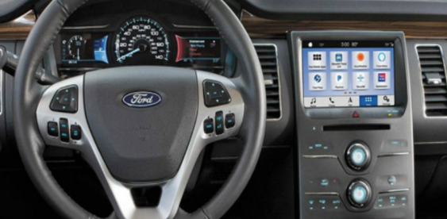

#CS 4331 - Human Computer Interaction

Team: Emily Quintanilla & Eric Santana

[Project Page](https://emilyqelizabeth.github.io/p2EmilyQuintanillaEricSantana/)

## Car Dashboards
  
  
  
  
  

## Pros & Cons of Current Designs
- Good
  - Designs that provide a number indicator for MPH simplify a users experience rather than reading a gauge. 
  - Having both a fuel and engine temperature gauge are necessary to avoid user complications.

- Bad
  - Overlapping gauges can over-complicate user experience.
  - Imbedded menu options require the user to spend too much time navigating
  - When gauges are related, like RPM and MPH, but are separated it adds unnecessary time to view the dashboard.

## Common Features & Rare Uses of a Car
- Common Features
  - Checking speedometer
  - Changing audio volume
  - Display time
  - Cruise control
  - Thermostat
  - Air control
  - Hazard lights
  - Warning and hazard light indicators
  - Lights (High beams, low beams, etc.)
  - Blinker arrows

- Rarely Used Features
  - Mileage
  - Oil life 
  - Gas tank locator
  - Stability control
  - Tire pressure monitor
  

## Controls the User Interacts With
  - Blinker switch
  - Cruise control button
  - Light switch
  - Hazard light button
  - Gas pedal and brake

## Common Mistakes That Can be Made With the Current Design
  - Misinterpreting dashboard indicated symbols
  - Too crowded around speedometer, having layered gauges
  - Too many buttons requires too much attention while driving

## Suggested Improvements for Control Interface
  - Overall modernization and clarity of the dashboard
  - Instead of having a speed gauge overlapping with RPM gauge, the two would be separate
  - We suggest the RPM gauge staying the same
  - The speed gauge would just be number displayed rather than a gauge the driver has to read
  - We suggest adding error lights by the gas gauge and engine temperature gauges to warn the user if they are low on gas, or if their car is too hot/cold
  - Add warning signs on the dashboard into the LCD display to make sure that the user understands what the error light means
  - Modern and touch screen LCD display that gives the user 4 application categories to be more user-friendly and less distracting when driving

## Dashboard and LCD Display Design
  

### Design Justification
  - Our design includes the good features that are implemented on existing car dashboards
  - It also implements our suggested improvements for the control interface 
  - From the features we disliked on existing dashboards and LCD displays, we redesigned them to be more user friendly and less distracting to drivers
  - We wanted to ensure that every user was able to understand the features on both their dashboard and LCD display through the simplified design

## Interactive Features on Dashboard
  - Turn signals arrows activate when the driver pulls the lane changer lever
  - Bright lights indicator activates when the driver activates the bright light lever
  - Warning lights turn on when a specific issue arises with the car
  - The user can also activate cruise control or their parking brake

## Interactive Features on LCD Display
  - Touch Screen:
    -  A settings app will provide the users to customize their stereo and clock
    -  A maps app will give the user directions to a specific location
    -  A music app allows the user to play music from a connected phone
    -  A car app displays messages from the dashboard, like warning signals, on the car’s LCD display

  - Buttons:
    - Dials allow the change of volume from the car’s stereo
    - Dials allow the change of temperature in the car
    - Air flow buttons can allow the user to change the circulation and levels of air flow

## User Feedback
  - User feedback through:
    - Warning lights through the dashboard and notifications through the LCD display.
    - Lane changing blinkers through the dashboard
    - Map details through the LCD display
    - MPH and RPM displays from the dashboard
    - Fuel and temperature levels
    - Music and settings through the LCD display

## Software Used
  - Figma to create and animate High Fidelity Prototype

## 